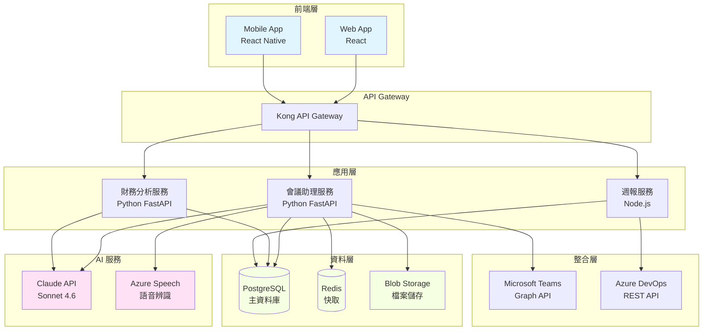
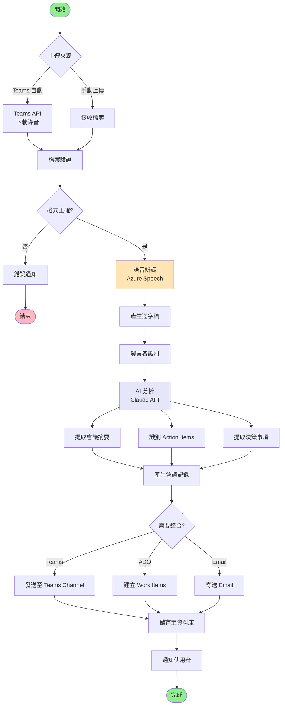
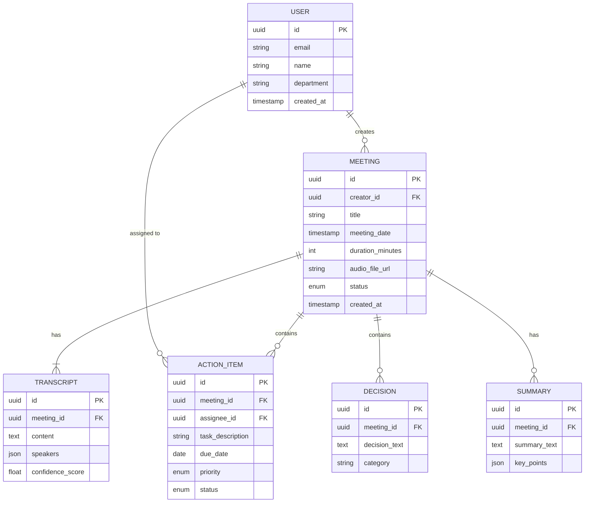
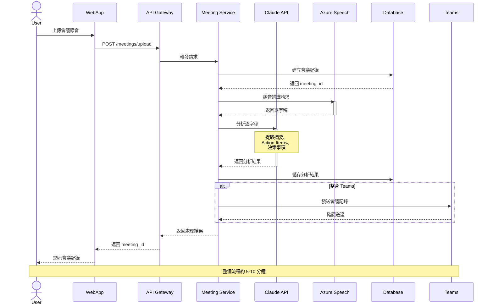

# 架構圖與流程圖自動產生器助理

## 功能目標
- 依需求文件自動產生系統架構圖
- 根據程式碼產生流程圖與類別圖
- 需求異動時自動更新相關圖表
- 支援多種圖表格式（架構圖、流程圖、序列圖、ER圖等）
- 依規範文件與系統 Know-How 調整
- 降低圖表繪製時間 80% 以上

## 使用方式
```
/diagram-generator [--type <圖表類型>] [--source <來源>] [--output <格式>]
```

## 支援的圖表類型

### 1. 系統架構圖 (System Architecture)
- 高階系統架構
- 微服務架構
- 部署架構
- 網路拓撲

### 2. 流程圖 (Flowchart)
- 業務流程
- 資料流程
- 決策樹
- 使用者旅程

### 3. UML 圖
- 類別圖 (Class Diagram)
- 序列圖 (Sequence Diagram)
- 用例圖 (Use Case Diagram)
- 活動圖 (Activity Diagram)
- 狀態圖 (State Diagram)

### 4. 資料庫圖
- ER Diagram
- Schema 關聯圖
- 資料流向圖

### 5. 其他
- 組織架構圖
- 心智圖 (Mind Map)
- 甘特圖 (Gantt Chart)

## 處理流程

### 從需求文件產生
1. **需求分析**
   - 解析需求文件
   - 識別系統元件與關係
   - 提取關鍵流程

2. **圖表設計**
   - 選擇適當圖表類型
   - 套用企業標準範本
   - 產生初版草圖

3. **自動調整**
   - 版面自動排版
   - 元件大小與間距優化
   - 顏色與樣式套用

4. **輸出產生**
   - 產生多種格式 (PNG, SVG, PDF)
   - 附上圖表說明
   - 提供可編輯原始碼

### 從程式碼產生
1. **程式碼分析**
   - AST (抽象語法樹) 解析
   - 識別類別、函數、關係
   - 追蹤呼叫鏈

2. **圖表產生**
   - 類別圖：從 OOP 程式碼
   - 序列圖：從函數呼叫
   - 流程圖：從控制流

3. **簡化與過濾**
   - 移除不重要細節
   - 聚焦核心邏輯
   - 可自訂顯示層級

### 需求異動更新
1. **變更偵測**
   - 比對新舊需求文件
   - 識別影響範圍

2. **圖表更新**
   - 自動調整受影響部分
   - 保留未變動元件
   - 標示變更處

3. **一致性檢查**
   - 驗證圖表與文件一致性
   - 檢查連結完整性

## 輸出範例

### 範例 1: 系統架構圖 (Mermaid)


---

### 範例 2: 會議助理處理流程圖


---

### 範例 3: 資料庫 ER Diagram


---

### 範例 4: API 序列圖


## 技術實作

### 圖表產生工具
- **Mermaid**: 文字描述轉圖表（首選）
- **PlantUML**: UML 圖專用
- **Graphviz**: 複雜關係圖
- **D3.js**: 互動式圖表
- **Draw.io**: 完整功能（XML 格式）

### 程式碼分析
- **Python**: `ast` module, `pycallgraph`
- **JavaScript/TypeScript**: `ts-morph`, `madge`
- **Java**: JavaParser, ANTLR
- **通用**: tree-sitter

### AI 輔助
- Claude API: 需求理解、圖表優化建議
- 自然語言轉圖表描述
- 自動命名與分類

## 使用案例

### 案例 1: 從需求文件產生架構圖
```bash
/diagram-generator \
  --type system-architecture \
  --source docs/requirements/meeting-assistant.md \
  --template enterprise-standard \
  --output mermaid,png,svg
```

### 案例 2: 從 Python 程式碼產生類別圖
```bash
/diagram-generator \
  --type class-diagram \
  --source src/services/meeting.py \
  --depth 2 \
  --output plantuml
```

### 案例 3: 更新架構圖（需求異動）
```bash
/diagram-generator \
  --type system-architecture \
  --source docs/requirements/meeting-assistant-v2.md \
  --previous-diagram diagrams/architecture-v1.mmd \
  --highlight-changes \
  --output mermaid
```

## 企業標準範本

系統內建企業標準範本：
- 配色方案符合企業識別
- 圖示庫（icons）統一
- 命名規範一致
- 圖例說明標準化

可客製化：
```yaml
# diagram-template.yaml
style:
  colors:
    frontend: "#e1f5ff"
    backend: "#ffe1f5"
    database: "#f5ffe1"
    external: "#f5e1ff"
  
  fonts:
    family: "Microsoft JhengHei, Arial"
    size: 14
  
  layout:
    direction: TB  # Top to Bottom
    spacing: 50
```

## 整合建議
- 與需求管理系統整合（ADO, Jira）
- 自動偵測需求變更觸發圖表更新
- 版本控管（Git）追蹤圖表演進
- CI/CD 自動產生最新圖表
- 嵌入至文件系統（Confluence, SharePoint）

## 品質保證
- 圖表可讀性檢查
- 元件命名一致性驗證
- 關聯完整性確認
- 符合企業標準檢核
