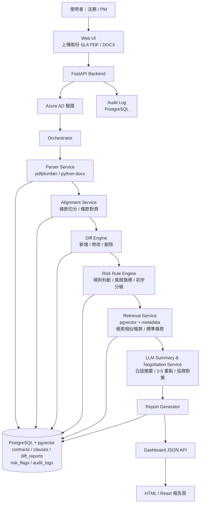
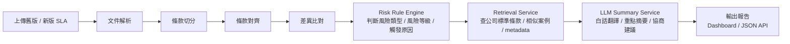
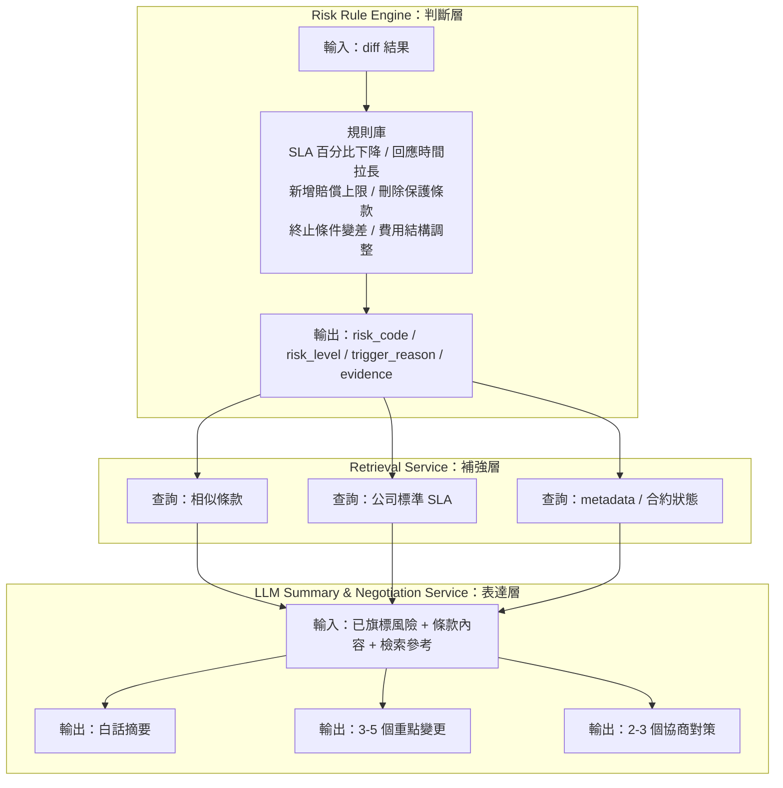

# 系統架構圖

**狀態**: 定案  
**最後更新**: 2026-06-17

---

## 系統架構圖（元件層）



---

## 系統運作流程（步驟層）



---

## 三層分工圖（判斷層 / 補強層 / 表達層）



---

## 資料庫 Schema（主要欄位）

```sql
-- 合約 metadata
CREATE TABLE contracts (
    id UUID PRIMARY KEY,
    filename VARCHAR(255),
    contract_type VARCHAR(50),  -- SLA / NDA / 採購
    version VARCHAR(50),
    uploaded_at TIMESTAMPTZ,
    uploaded_by VARCHAR(100)
);

-- 條款（clause-level，存 embedding）
CREATE TABLE clauses (
    id UUID PRIMARY KEY,
    contract_id UUID REFERENCES contracts(id),
    clause_number VARCHAR(50),  -- 如 "5.2"
    title VARCHAR(255),
    content TEXT,
    embedding VECTOR(1536)
);

-- 差異比對結果
CREATE TABLE diff_reports (
    id UUID PRIMARY KEY,
    original_contract_id UUID REFERENCES contracts(id),
    revised_contract_id UUID REFERENCES contracts(id),
    created_at TIMESTAMPTZ,
    total_changes INT,
    overall_risk_level VARCHAR(10)  -- high / medium / low
);

-- 風險旗標（一對多：一份 diff_report 有多筆）
CREATE TABLE risk_flags (
    id UUID PRIMARY KEY,
    diff_report_id UUID REFERENCES diff_reports(id),
    clause_id UUID REFERENCES clauses(id),
    risk_code VARCHAR(50),       -- RISK_SLA_DEGRADE / RISK_LIABILITY_CAP_ADDED ...
    risk_level VARCHAR(10),      -- high / medium / low
    trigger_reason TEXT,
    old_text TEXT,
    new_text TEXT
);

-- 審計日誌
CREATE TABLE audit_logs (
    id UUID PRIMARY KEY,
    user_id VARCHAR(100),
    action VARCHAR(50),
    resource_id UUID,
    created_at TIMESTAMPTZ
);
```
