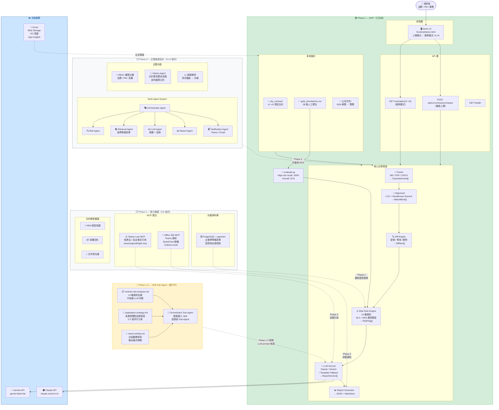

# Blue-AI 合約智能比對助理 — 系統架構圖

## 完整架構（含 Phase 分區）



---

## Phase 說明

| Phase | 狀態 | 時間 | 核心目標 |
|---|---|---|---|
| **Phase 1** | 🟢 已完成 | 2026-06 | SLA/NDA 比對 + FastAPI + Demo UI |
| **Phase 1.5** | 🔄 進行中 | 2026-06~07 | Skill Sub-Agent 架構，Prompt 與程式碼分離 |
| **Phase 2** | ⬜ 規劃中 | 2026-07~09 | pgvector 條款庫 + Taiwan Law MCP + Teams |
| **Phase 3** | ⬜ 規劃中 | 2026-10~12 | 完整 MAS + RBAC + 歷史追蹤 + 企業級 |

---

## 核心設計原則

```
Rule Engine 做判斷  →  LLM 做解釋
（不讓 AI 猜風險等級，防止幻覺漏判）
```

| 層級 | 職責 | 實作 |
|---|---|---|
| **Rule Engine** | 判斷 / 標記風險等級 | 14 條 Python 規則，pure logic |
| **LLM Service** | 白話解釋 + 協商對策 | Claude / Gemini / Template fallback |
| **Skill Sub-Agent** | Prompt 定義（Phase 1.5） | `.claude/skills/*.md` |
| **MAS Orchestrator** | 多 Agent 協調（Phase 3） | 動態路由，支援並行處理 |

---

## 驗證指標

| 指標 | 數值 | 說明 |
|---|---|---|
| High-risk recall | **100%** | 高風險條款一筆不漏（38 筆 gold set） |
| Overall detection | **61%** | 保守設計，寧可高判不漏判 |
| 支援格式 | MD / PDF / DOCX | Phase 2 加入掃描 PDF（OCR） |
| 支援合約類型 | SLA / NDA | Phase 2 加入採購 / 意向書 |
