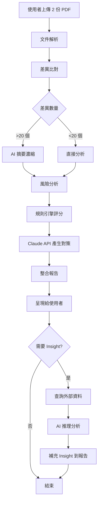

# 合約文件差異比對專案 - 重新定位（基於部長回饋）

**日期**: 2026-06-09  
**專案名稱**: 合約文件(SLA/NDA/採購)智能差異比對與風險分析系統  
**狀態**: 需求確認與方向調整

---

## 📋 部長核心回饋整理

### ✅ 確認事項

1. **維持原題目**：「合約文件(SLA/NDA/採購)差異比對」
   - 這是真實的人員回饋需求
   - 有實際使用場景

2. **可擴大範圍**：不只做「差異比對」
   - 需要前後 Summary
   - 需要風險識別與對策建議
   - 需要 Insight 分析（進階智能判斷）

3. **資料來源明確**：
   - ✅ EIP 上有 SLA、合約範本
   - ✅ PM 可提供超商 SLA 作比對
   - ✅ 有真實資料可測試

4. **競品參考**：Lumine AI 已有類似功能
   - 需要做得更好
   - 重點是「精要、重點、有建議」而非「列 100 個差異」

### 🎯 關鍵需求

| 需求 | 說明 | 優先級 |
|------|------|--------|
| **基礎比對** | 找出兩份合約的差異 | P0（必須） |
| **智能摘要** | 不只列差異，要總結「主要變更」 | P0（必須） |
| **風險分析** | 識別哪些差異是風險 | P0（必須） |
| **對策建議** | 如何降低/解決風險 | P1（重要） |
| **Insight 分析** | 例：罰款合理性判斷（需外部資料） | P2（加分） |
| **週報整併** | 2份週報 → 1份月報 | P2（衍伸） |

---

## 💡 重新定位的專案方向

### 原本的問題：功能太發散

```
原 contract-diff skill:
❌ 10 層 diff 演算法（過度設計）
❌ 詐欺偵測（太複雜，用不到）
❌ 94% 準確率（無法驗證）
❌ <10 秒處理 100 頁（不切實際）
❌ 支援 6 種合約（工作量太大）
```

### 新方向：聚焦實際需求

```
新定位：
✅ 差異比對 + 智能摘要 + 風險分析 + 對策建議
✅ 重點不是「找到所有差異」，而是「找出重要差異」
✅ 不只告訴你「哪裡變了」，還告訴你「為什麼重要」「怎麼辦」
✅ 先做 SLA（最常用），再擴展到 NDA、採購
```

---

## 🏗️ 功能架構設計

### Level 1: 基礎差異比對（必須）

```python
# 輸入
original_contract = "SLA_v1.pdf"
revised_contract = "SLA_v2.pdf"

# 輸出
differences = [
    {
        "clause": "第 5.2 條 - 服務可用性",
        "type": "修改",
        "original": "服務可用性應達 99.9%",
        "revised": "服務可用性應達 99.5%",
        "impact": "允許停機時間增加 3.5 倍"
    },
    # ... 其他差異
]
```

**技術實作**：
- PDF 解析：pdfplumber（文字版）+ Tesseract（掃描版）
- Diff 演算法：difflib（文字層） + 語意相似度（移動段落偵測）
- 不需要 10 層演算法，夠用就好

### Level 2: 智能摘要（重點！）

**問題**：100 個差異點 → 使用者看不完

**解法**：AI 濃縮成「3-5 個主要變更」

```python
# AI 摘要（使用 Claude）
summary = {
    "overall_assessment": "🟡 中度風險，需協商",
    "major_changes": [
        {
            "category": "SLA 降低",
            "description": "服務可用性從 99.9% 降至 99.5%，允許停機時間增加 3.5 倍",
            "risk_level": "🔴 高",
            "affected_clauses": ["5.2", "5.3"]
        },
        {
            "category": "費用調整",
            "description": "月費從 $50,000 調至 $52,000（漲 4%），超量費用從 $10/GB 調至 $12/GB（漲 20%）",
            "risk_level": "🟡 中",
            "affected_clauses": ["3.1", "3.2"]
        },
        {
            "category": "刪除條款",
            "description": "刪除「每季免費教育訓練」條款",
            "risk_level": "🟢 低",
            "affected_clauses": ["7.4"]
        }
    ],
    "change_count": {
        "total": 12,
        "high_risk": 1,
        "medium_risk": 3,
        "low_risk": 8
    }
}
```

**價值**：
- 法務主管 30 秒就能掌握重點
- 不用看完 100 個差異點

### Level 3: 風險分析與對策（核心價值）

```python
risk_analysis = {
    "risk_1": {
        "clause": "第 5.2 條 - SLA 降低",
        "risk_description": "99.9% → 99.5% 意味著：每月允許停機時間從 43 分鐘增加到 3.6 小時",
        "business_impact": "若系統停機，影響 1000 位用戶，每小時損失約 $5000 營收",
        "potential_loss": "最大月損失從 $3600 增加到 $18000",
        
        # 對策建議（這是關鍵！）
        "mitigation_strategies": [
            {
                "strategy": "協商維持原 SLA",
                "feasibility": "高",
                "approach": "強調業務關鍵性，要求維持 99.9% 或降低月費作為補償"
            },
            {
                "strategy": "要求提高賠償比例",
                "feasibility": "中",
                "approach": "若接受 99.5% SLA，要求賠償比例從 5% 提高至 15%"
            },
            {
                "strategy": "增加監控條款",
                "feasibility": "高",
                "approach": "要求供應商提供即時監控 dashboard，停機立即通知"
            }
        ],
        
        "recommendation": "🔴 建議協商：堅持維持 99.9% SLA，這是業務關鍵指標"
    }
}
```

**價值**：
- 不只說「有風險」，還告訴你「怎麼辦」
- 法務可直接拿這些建議去協商

### Level 4: Insight 分析（進階，部長提的重點）

#### 案例 1：罰款合理性判斷

```python
# 情境：客戶調整罰款條款
change = {
    "clause": "違約罰款",
    "original": "違約金為合約總價 10%",
    "revised": "違約金為合約總價 5%"
}

# AI Insight 分析流程
insight_analysis = {
    "step_1_extract_info": {
        "penalty_original": "10%",
        "penalty_revised": "5%",
        "contract_value": "$500,000",  # 從合約抽取
        "customer": "ABC 零售股份有限公司"
    },
    
    "step_2_external_data": {
        # 整合外部資料
        "customer_capital": "$50M",      # 從公開資訊觀測站
        "project_budget": "$500K",       # 從內部 ERP/專案系統
        "industry_standard": "5-15%",    # 從知識庫
        "previous_contracts": [          # 歷史合約資料
            {"customer": "ABC", "penalty": "10%", "year": 2024},
            {"customer": "ABC", "penalty": "10%", "year": 2025}
        ]
    },
    
    "step_3_reasoning": {
        "penalty_amount_change": "$50K → $25K",
        "customer_size": "中型企業（資本額 $50M）",
        "penalty_ratio_to_capital": "0.05%（非常小）",
        "comparison_to_history": "過去 2 年都是 10%，首次降低",
        "comparison_to_industry": "5% 在產業標準下限"
    },
    
    "step_4_insight": {
        "finding": "🟡 罰款調降至產業下限，對供應商保護降低",
        "reasoning": [
            "罰款從 $50K 降至 $25K，降低 50%",
            "客戶資本額 $50M，$25K 罰款比例僅 0.05%，約束力極低",
            "過去合約都是 10%，此次降低可能反映供應商議價能力減弱",
            "5% 已是產業標準下限，再低可能失去約束力"
        ],
        "recommendation": "建議維持 10% 或至少 8%，並加入其他約束條款（如分期付款、履約保證金）"
    }
}
```

#### 案例 2：付款條件變更分析

```python
# 情境：付款條件從「月結 30 天」改為「月結 60 天」
insight_analysis = {
    "change": "付款期限延長 30 天",
    
    "external_data": {
        "customer_credit_rating": "BBB",  # 從徵信機構
        "customer_cash_flow": "近 3 個月現金流緊張", # 從財報
        "industry_payment_term": "30-45 天"
    },
    
    "insight": {
        "finding": "🔴 付款條件惡化，可能反映客戶財務狀況不佳",
        "risk": "收款風險增加，可能影響現金流",
        "recommendation": [
            "要求提供銀行履約保證",
            "分期收款（30% 簽約、40% 交付、30% 驗收）",
            "或要求縮短至 45 天作為折衷"
        ]
    }
}
```

**技術實作**：
```python
# 資料整合來源
data_sources = {
    "內部資料": [
        "ERP 系統（專案預算、歷史合約）",
        "CRM 系統（客戶資料）",
        "財務系統（應收帳款、現金流）"
    ],
    
    "外部資料": [
        "公開資訊觀測站（上市櫃公司資本額、財報）",
        "徵信機構 API（客戶信用評級）",
        "產業知識庫（標準條款、市場行情）"
    ],
    
    "AI 推理": [
        "Claude API（整合多源資料，產生 insight）",
        "知識圖譜（合約條款關聯性）"
    ]
}
```

---

## 🎯 差異化策略（vs Lumine AI）

### Lumine AI 的問題（根據部長反饋）

```
❌ 列出 100 個差異點
❌ 缺乏重點整理
❌ 沒有精要的建議
❌ 使用者還是要自己判斷
```

### 我們的差異化

```
✅ 智能摘要：100 個差異 → 3-5 個主要變更
✅ 風險分級：自動標示 🔴🟡🟢
✅ 對策建議：告訴你「怎麼辦」而非只有「哪裡變了」
✅ Insight 分析：整合外部資料，智能判斷（例：罰款合理性）
✅ 繁中優化：專為台灣法律與商業環境設計
```

### 核心價值主張

| 功能 | Lumine AI | 我們的系統 | 差異化價值 |
|------|-----------|------------|------------|
| 差異偵測 | ✅ 有 | ✅ 有 | 基本功能 |
| 差異數量 | 100+ 個 | 3-5 個主要變更 | 💡 節省閱讀時間 |
| 風險分析 | 基本 | 深度（含商業影響） | 💡 量化風險 |
| 對策建議 | ❌ 無 | ✅ 3-5 個可行方案 | 💡 直接可用於協商 |
| Insight | ❌ 無 | ✅ 整合外部資料判斷 | 💡 AI 顧問級分析 |
| 繁中支援 | 一般 | 深度優化 | 💡 理解台灣法律用語 |

---

## 📅 階段性開發計畫

### Phase 1: MVP（2-3 個月）- 驗證核心價值

#### 範圍

**聚焦 SLA 合約**（最常用，部長已有資料來源）

**功能**：
1. ✅ PDF 差異比對（文字版 SLA）
2. ✅ 智能摘要（3-5 個主要變更）
3. ✅ 風險分析（高/中/低）
4. ✅ 基礎對策建議（規則引擎）

**不做**：
- ❌ Insight 分析（需外部資料整合）
- ❌ NDA、採購合約（先專注 SLA）
- ❌ 掃描版 PDF（OCR 複雜）
- ❌ 週報整併（衍伸功能）

#### 技術架構

```python
# 簡化技術棧
tech_stack = {
    "文件解析": "pdfplumber（文字版 PDF）",
    "差異比對": "difflib + 簡單語意相似度",
    "AI 分析": "Claude Sonnet 4.6（成本效益平衡）",
    "知識庫": "SLA 常見條款與風險規則（內建）",
    "部署": "本地部署（避免資料外洩）",
    "前端": "簡單 Web UI（上傳 2 份 PDF → 顯示報告）"
}
```

#### 測試資料

```markdown
## 資料來源（部長已確認）

1. **EIP 上的 SLA 範本**
   - 取得公司標準 SLA 範本
   - 作為「基準版本」

2. **PM 提供的超商 SLA**
   - 真實客戶合約
   - 可比對「標準版 vs 客戶版」

3. **脫敏處理**
   - 移除客戶名稱、金額（測試用）
   - 保留條款結構

## 測試案例設計

**Case 1: SLA 標準變更**
- 標準版 SLA vs 降低版（99.9% → 99.5%）
- 驗證：能否正確識別風險並建議對策

**Case 2: 費用調整**
- 舊合約 vs 漲價版
- 驗證：能否計算漲幅並判斷合理性

**Case 3: 條款刪除**
- 完整版 vs 刪除教育訓練條款
- 驗證：能否識別刪除並評估影響
```

#### 成功指標

```markdown
## MVP 成功標準

### 功能性指標
- ✅ 能正確比對 10 頁以內的 SLA（準確率 >90%）
- ✅ 摘要能濃縮至 3-5 個主要變更
- ✅ 風險分級與實際法務判斷一致性 >80%
- ✅ 處理時間 <3 分鐘

### 業務指標
- ✅ 法務審查時間減少 >50%（從 2 小時 → <1 小時）
- ✅ 使用者滿意度 >4.0/5.0
- ✅ 至少 3 位法務人員願意持續使用

### 安全指標
- ✅ 無資料外洩事件
- ✅ 通過資安部門審查
```

#### 資源需求

```markdown
## 人力配置

- **1 位 AI/Backend 工程師**（主力開發）
  - PDF 解析與 diff 演算法
  - Claude API 整合
  - 規則引擎開發

- **1 位 Frontend 工程師**（0.5 人月）
  - 簡單 Web UI
  - 報告呈現

- **0.3 位法律顧問**（兼職諮詢）
  - 協助定義風險規則
  - 驗證 AI 輸出正確性

- **1 位 PM**（協調與測試）
  - 收集測試資料
  - 協調法務部門試用

## 時程

- Week 1-2: PDF 解析與基礎 diff
- Week 3-4: Claude API 整合與摘要功能
- Week 5-6: 風險分析規則引擎
- Week 7-8: UI 開發與整合測試
- Week 9-10: 法務部門試用與調整
- Week 11-12: 修正與上線準備

**總計**: 2.5-3 個月

## 成本估算

- 人力: $180K - $220K（2.5 個月 x 2.3 人）
- 基礎設施: $3K（Azure VM + Storage）
- Claude API: $500（測試用量）
- 法律諮詢: $10K

**總計**: $193K - $233K
```

### Phase 2: 擴展功能（3-6 個月後）

**前提**: Phase 1 成功（滿意度 >4.0，法務願意用）

#### 新增功能

1. **Insight 分析**
   - 整合外部資料（公開資訊觀測站 API）
   - 整合內部資料（ERP、CRM）
   - 智能判斷（罰款合理性、付款條件風險）

2. **NDA 合約支援**
   - 新增 NDA 專用規則
   - 保密期限、範圍分析

3. **採購合約支援**
   - 價格、交期、驗收條款分析

4. **OCR 支援**
   - 掃描版 PDF 處理

#### 資源需求

- 人力: 1.5-2 人 x 3 個月
- 成本: $250K - $350K

### Phase 3: 衍伸功能（6 個月後）

#### 週報整併功能

```python
# 功能描述
feature = {
    "輸入": ["週報_第1週.docx", "週報_第2週.docx"],
    "輸出": "月報_6月.docx",
    
    "處理邏輯": {
        "抽取": "從 2 份週報抽取關鍵資訊（專案進度、問題、風險）",
        "去重": "相同專案的重複資訊合併",
        "摘要": "AI 產生月度總結",
        "格式": "依公司月報範本格式輸出"
    },
    
    "技術": "與合約比對類似（文件解析 + AI 摘要）"
}
```

**價值**：
- PM 每月節省 2-3 小時
- 可復用合約比對的技術棧

---

## 🔧 技術實作細節

### 核心模組設計

```python
# 系統架構
class ContractDiffSystem:
    """合約差異比對系統"""
    
    def __init__(self):
        self.parser = DocumentParser()          # 文件解析
        self.comparator = ContractComparator()  # 差異比對
        self.summarizer = AISummarizer()        # AI 摘要
        self.risk_analyzer = RiskAnalyzer()     # 風險分析
        self.insight_engine = InsightEngine()   # Insight 分析（Phase 2）
    
    def process(self, original_pdf, revised_pdf, contract_type="SLA"):
        """主流程"""
        
        # 1. 解析文件
        original_doc = self.parser.parse(original_pdf)
        revised_doc = self.parser.parse(revised_pdf)
        
        # 2. 差異比對
        differences = self.comparator.compare(
            original_doc, 
            revised_doc,
            contract_type=contract_type
        )
        
        # 3. AI 摘要（濃縮差異）
        summary = self.summarizer.summarize(
            differences, 
            max_changes=5  # 最多 5 個主要變更
        )
        
        # 4. 風險分析
        risks = self.risk_analyzer.analyze(
            differences,
            contract_type=contract_type
        )
        
        # 5. 產生報告
        report = self.generate_report(summary, risks, differences)
        
        return report
```

### AI 提示詞設計（關鍵）

```python
# Claude API 提示詞範例
SUMMARIZATION_PROMPT = """
你是專業的合約分析助理。以下是兩份 SLA 合約的 12 處差異。

請濃縮成 3-5 個「主要變更」，每個變更需包含：
1. 變更類別（例：SLA 降低、費用調整、條款刪除）
2. 具體描述（量化差異）
3. 風險等級（高/中/低）
4. 影響的條款編號

原則：
- 優先列出高風險變更
- 合併相關的小變更（例：多個費用調整合併為「費用調整」）
- 忽略不重要的行政性變更（例：聯絡人電話）

差異清單：
{differences}

請以 JSON 格式輸出。
"""

RISK_MITIGATION_PROMPT = """
針對以下合約變更，提供 2-3 個具體的風險降低對策。

變更：{change_description}
風險：{risk_description}

每個對策需包含：
1. 策略名稱
2. 可行性（高/中/低）
3. 具體做法（可直接用於協商）

範例：
策略：協商維持原 SLA
可行性：高
做法：強調業務關鍵性，要求維持 99.9% 或降低月費作為補償

請提供實際可執行的建議，避免空泛的說法。
"""
```

### 規則引擎設計

```python
# SLA 風險規則庫
class SLARiskRules:
    """SLA 合約風險規則"""
    
    RULES = {
        "sla_degradation": {
            "pattern": r"可用性.*?(\d+\.?\d*)%.*?(\d+\.?\d*)%",
            "threshold": 0.1,  # 降低 0.1% 以上視為高風險
            "risk_calculator": lambda old, new: {
                "risk_level": "高" if (old - new) >= 0.1 else "中",
                "impact": f"允許停機時間增加 {calculate_downtime_increase(old, new)} 倍"
            }
        },
        
        "penalty_reduction": {
            "pattern": r"賠償.*?(\d+)%.*?(\d+)%",
            "threshold": 5,  # 降低 5% 以上視為中風險
            "risk_calculator": lambda old, new: {
                "risk_level": "中" if (old - new) >= 5 else "低",
                "impact": f"賠償金額減少 {((old - new) / old * 100):.0f}%"
            }
        },
        
        "deleted_clause": {
            "critical_clauses": [
                "教育訓練", "技術支援", "資料備份", "災難復原"
            ],
            "risk_calculator": lambda clause_name: {
                "risk_level": "中" if clause_name in critical_clauses else "低"
            }
        }
    }
    
    def analyze(self, change):
        """分析單一變更的風險"""
        for rule_name, rule in self.RULES.items():
            if self.match(change, rule):
                return rule["risk_calculator"](change)
        return {"risk_level": "低"}
```

---

## 📊 資料流程圖



---

## 🎯 與 Lumine AI 競爭策略

### 產品定位

```markdown
## 我們 ≠ Lumine AI 的複製品

### Lumine AI
- 定位：通用合約管理平台
- 強項：合約生命週期管理、簽核流程
- 弱項：差異分析不夠深入、缺乏在地化

### 我們
- 定位：**台灣企業專用的智能合約分析顧問**
- 強項：
  - 深度差異分析（不只列差異，還告訴你為什麼重要）
  - 智能對策建議（直接可用於協商）
  - 繁中法律優化（理解台灣合約用語）
  - Insight 分析（整合外部資料判斷）
- 差異化：**像有一個資深法務顧問幫你審合約**
```

### 行銷話術

```markdown
## Slogan

**「不只找出差異，更告訴你怎麼辦」**

## 價值主張

❌ Lumine AI: 列出 100 個差異 → 你還是要自己判斷
✅ 我們: 濃縮成 5 個重點 → 直接給你協商建議

## 使用情境對比

### Lumine AI
法務：「系統列了 100 個差異，我要花 2 小時看完...」

### 我們的系統
法務：「系統說有 3 個高風險變更需要注意：
1. SLA 降低（建議協商維持 99.9%）
2. 罰款減半（建議至少保持 8%）
3. 刪除教育訓練（影響不大，可接受）

我只要針對前 2 項去談就好了。30 分鐘搞定！」
```

---

## ⚠️ 風險與對策（更新版）

### 技術風險（降低）

| 風險 | 原評估 | 新評估 | 原因 |
|------|--------|--------|------|
| PDF 解析失敗 | 🟡 中 | 🟢 低 | 部長確認有文字版 SLA，不需 OCR |
| AI 準確率 | 🔴 高 | 🟡 中 | 摘要與建議允許人工調整，不需 94% |
| 效能問題 | 🟡 中 | 🟢 低 | SLA 通常 <20 頁，3 分鐘可接受 |

### 政策風險（降低）

| 風險 | 原評估 | 新評估 | 原因 |
|------|--------|--------|------|
| 資料外洩 | 🔴 極高 | 🟡 中 | 本地部署 + 內部資料來源 |
| AI 責任 | 🔴 極高 | 🟡 中 | 定位「建議」而非「決策」 |
| 組織接受度 | 🔴 高 | 🟢 低 | 部長支持 + 法務有需求 |

### 新增風險

| 風險 | 評估 | 對策 |
|------|------|------|
| Insight 資料整合困難 | 🟡 中 | Phase 2 才做，先驗證核心價值 |
| EIP 資料存取權限 | 🟡 中 | 與 IT 部門協調 API 存取 |
| 測試資料不足 | 🟢 低 | 部長已確認有 SLA 可用 |

---

## 📋 下一步行動

### 本週（Week 1）

1. ✅ **與法務部門訪談**
   - 確認 SLA 審查流程
   - 了解痛點與期望
   - 收集 2-3 份範例 SLA（脫敏）

2. ✅ **技術 POC**
   - 測試 pdfplumber 解析 SLA
   - 測試 Claude API 摘要功能
   - 驗證可行性

3. ✅ **取得測試資料**
   - 從 EIP 下載 SLA 範本
   - 向 PM 索取超商 SLA（脫敏）

### 下週（Week 2）

1. **開發環境設定**
   - Azure VM 申請（本地部署）
   - Claude API 申請
   - Git repo 建立

2. **核心模組開發**
   - PDF 解析模組
   - 基礎 diff 演算法

3. **專案啟動會議**
   - 法務、IT、資安、開發團隊
   - 確認資料安全方案
   - 確認時程與資源

### 本月（Month 1）

1. **MVP 開發**
   - 完成差異比對 + 摘要功能
   - 簡單 UI

2. **內部測試**
   - 用真實 SLA 測試
   - 收集法務反饋

---

## 💡 總結建議

### ✅ 這個方向可行的理由

1. **需求明確**：部長已確認這是真實需求
2. **資料可得**：EIP 有範本、PM 有真實案例
3. **範圍合理**：先做 SLA，不貪多
4. **差異化清楚**：vs Lumine AI 有明確優勢
5. **技術可行**：不需要 94% 準確率，摘要與建議即可
6. **風險可控**：本地部署 + 人工複核

### 🎯 成功關鍵

1. **聚焦價值**：不是「比對技術」，而是「節省時間 + 提供建議」
2. **人機協作**：AI 輔助，人類決策
3. **持續優化**：從使用者反饋持續改進規則與提示詞
4. **階段推進**：先 SLA，再 NDA、採購，最後 Insight

### 📈 預期成果

**3 個月後（MVP）**：
- 法務審查 SLA 時間從 2 小時 → 30 分鐘
- 至少 3 位法務願意持續使用
- 為 Phase 2（Insight）奠定基礎

**6 個月後（擴展）**：
- 支援 SLA + NDA + 採購
- 整合外部資料（Insight 分析）
- 成為法務部門標準工具

**12 個月後（企業級）**：
- 衍伸到週報整併等其他文件分析
- 可能對外銷售（SaaS 產品）

---

**結論**：基於部長的回饋，這個專案**高度可行且有明確價值**。建議立即啟動 MVP 開發！🚀
