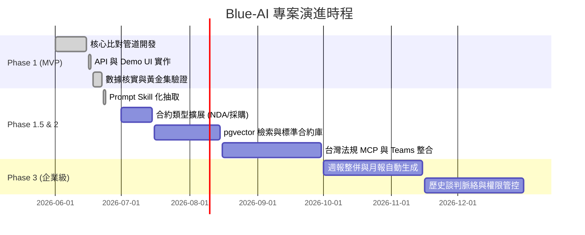

# 專案週報：Blue-AI 合約智能比對助理

**報告日期**：2026-06-22  
**彙整人**：專案團隊  
**專案定位**：「像有一個資深法務顧問幫你審合約」—— 讓法務與 PM 在 30 分鐘內完成過去需要 2 小時的合約審查。

---

## 一、專案脈絡

### 1. 痛點分析與市場數據（簡報核心數據）

在合約審查與管理中，企業面臨顯著的時間與財務瓶頸：

* **時間瓶頸**：人工審閱一份合約平均需 **92 分鐘**，而在歷史合約中搜尋特定條款或關鍵字，法務平均需耗費 **2 小時**（Juro 2026、Concord CLM）。
* **業務受阻**：**71%** 的受訪者抱怨合約談判時間過長；**40%** 的法務主管承認合約風險管理是「緩慢且被動」的流程（Infosys BPM、Gartner）。
* **財務代價**：合約審查延誤新產品上市平均達 **6.5 天**，造成 **700 萬美元**營收損失；合約管理不善使企業流失高達 **9% 年營收**（Gartner、McKinsey）。

> McKinsey 補充說明：常被引用的「2 小時」數字實為搜尋條款的耗時，McKinsey 最權威的數字是「合約管理不善流失 9% 年營收」，簡報建議使用後者。

### 2. 我們的解法與差異化定位

* **核心解法**：將審閱時間壓縮至 **30 分鐘內**。
* **與 Lumine AI 的功能定位**：Blue-AI 以 Lumine AI 的差異偵測能力為基礎，往上疊加三層決策支援，兩者定位互補，未來可整合進同一工作流。

| 功能層次 | Lumine AI | Blue-AI（延伸） |
| --- | --- | --- |
| 條款差異偵測 | ✅ 核心能力 | ✅ 沿用 |
| 重點摘要（3-5 點） | — | ✅ 新增 |
| 風險等級標示（高／中／低） | — | ✅ 新增 |
| **協商對策建議** | — | ✅ 新增 |
| 可量化召回率驗證 | — | ✅ 新增 |
| 繁體中文 SLA / NDA 優化 | — | ✅ 新增 |

* **核心架構原則**：「**Risk Rule Engine 做判斷與標記，LLM 做解釋與表達**」。LLM 不直接參與風險等級判定，保證輸出穩定、可解釋、無黑箱。

---

## 二、月會簡報大綱（20 分鐘）

### 時間分配

| 時間 | 投影片主題 | 核心內容要點 |
| :--- | :--- | :--- |
| **0-2 分** | 問題與痛點 | 92 分鐘、2 小時、71%、40%——直擊人工審約的無效勞動 |
| **2-4 分** | 財務與商業代價 | 延誤 6.5 天、700 萬美元、9% 年營收流失 |
| **4-6 分** | 功能延伸定位 | Lumine AI 提供差異偵測基礎，Blue-AI 往上疊加風險判讀與協商建議，兩者互補 |
| **6-10 分** | 我們的解法 | 架構圖 + 三層核心價值（摘要 → 風險 → 對策） |
| **10-15 分** | **現場 Demo** | v4 保護條款刪減版，展示 6 個高風險 + 協商對策 + 下載報告 |
| **15-17 分** | 技術亮點 | Rule Engine 100% recall、LLM 結構化輸入、可驗證 |
| **17-20 分** | 商機與 ROI | 內部每週節省 10+ 工時、外部 SaaS 市場 $1.5B-$5B NTD |

---

### 逐張 Slide 文字稿

**Slide 1 — 標題**
```
Blue-AI 合約智能比對助理

「像有一個資深法務顧問幫你審合約」

Blue-AI Team｜2026-06
```

---

**Slide 2 — 問題：時間都去哪了**

標題：每份合約，平均消耗 92 分鐘

- 🕐 人工審閱一份合約：平均 **92 分鐘**（Juro 2026）
- 🔍 光搜尋特定條款：最長 **2 小時**（Juro 2026）
- 📋 合約管理耗用法務部門 **50%** 工作時間（Juro 2026）

---

**Slide 3 — 問題：範圍有多廣**

標題：這不是個別問題

- **71%** 企業受訪者：合約談判時間太長（Infosys BPM）
- **40%** 法務主管：風險管理是「緩慢且被動」的流程（Gartner）
- 只有 **11%** 企業認為自己的合約管理流程「有效」（Juro）

---

**Slide 4 — 問題：代價有多高**

標題：慢，是有成本的

- 延誤新產品上市 **6.5 天** → 造成 **700 萬美元**營收損失（Gartner）
- 合約管理不善流失高達 **9%** 年營收（McKinsey）

---

#### Slide 5 — 功能延伸定位

標題：站在 Lumine AI 的肩膀上，往上疊加決策支援

> Lumine AI 已做好差異偵測，Blue-AI 接著告訴你：哪個重要、風險多高、怎麼談。

（插入上方功能定位表格）

> 未來整合方向：使用者在 Lumine AI 取得差異清單後，一鍵進入 Blue-AI 進行風險研判與協商建議，兩個系統串成完整工作流。

---

**Slide 6 — 我們的解法**

標題：三層價值，一個流程

```
上傳兩份合約
     ↓
差異比對   → 找出所有新增／修改／刪除
     ↓
風險分析   → 高／中／低，附商業影響說明
     ↓
對策建議   → 每個高風險給 2-3 個協商方案
     ↓
完整報告   → 30 分鐘完成，可直接帶去談判
```

核心原則：Rule Engine 做判斷，LLM 做解釋。風險等級不交給 AI 猜。

---

**Slide 7 — 技術亮點**

標題：可量化、可驗證、可解釋

1. **Rule-based 風險引擎**
   - 11 條規則，涵蓋 SLA / 責任 / 保護條款 / 終止 / 保密
   - High-risk recall：**100%**（38 筆 gold set 驗證）

2. **LLM 只做解釋，不做判斷**
   - 接收結構化風險旗標 → 輸出白話摘要 + 協商對策
   - 降低幻覺風險，輸出可追溯

3. **Skill Sub-Agent 架構**
   - 每個分析任務由獨立 Sub-Agent 執行（風險分析 / 協商策略 / 報告產出）
   - Skill 定義與程式碼分離，法務可直接修改協商偏好，不需工程師介入
   - 未來可延伸為完整 Multi-Agent System（MAS），支援跨文件並行分析

4. **無 API Key 也能跑**
   - Template fallback，Demo 不受限

---

**Slide 8 — 現場 Demo**

標題：直接看結果

Demo 流程：
1. 開啟 `frontend/demo.html`
2. 點「v4 保護刪減」範例
3. 展示：整體評估 🔴 → 13 處變更，6 高風險 → 協商對策展開 → 下載報告

預期展示重點：
- 必須協商：第 4.4、8.4、11.1、11.2、11.3、12.3 條
- 每條附上 2-3 個協商方案

---

**Slide 9 — 未來展望**

標題：這只是開始

Phase 2（3 個月後）：
- 支援 NDA、採購合約
- 整合 Taiwan Law MCP（自動引用個資法、民法條文）
- 整合 Microsoft Teams（比對完成自動通知法務）

Phase 3（6 個月後）：
- Insight 分析：自動查對方公司資本額，判斷罰款合理性
- 歷史脈絡追蹤：每次合約版本修改記錄

---

**Slide 10 — 商機**

標題：內部節省 + 外部商機

內部 ROI：
- 法務、採購、業務三部門均有需求
- 每週節省 10+ 小時人工工時
- 92 分鐘 → 30 分鐘，效率提升 **67%**

外部商機：
- 台灣中大型企業普遍缺法務資源，本土化是優勢
- $3,000-$10,000/席次 × 500 家企業 ≈ **$1.5B-$5B NTD**

---

**Slide 11 — 結語**

```
92 分鐘  →  30 分鐘

像有一個資深法務顧問幫你審合約

github.com/rock4andruw/blue_ai_contract
```

---

## 三、專案各階段目標與時程



### Phase 1：MVP 核心管道（已完成）

**目標**：完成 SLA 合約比對管道，包裝成 API 並提供靜態 Demo UI。

| 里程碑 | 狀態 |
| --- | --- |
| Parser（MD/PDF/DOCX）| ✅ |
| Alignment（LCS + Needleman-Wunsch）| ✅ |
| Diff Engine | ✅ |
| Risk Rule Engine（11 條規則）| ✅ |
| High-risk recall 驗證 100% | ✅ |
| LLM Service（Claude API + fallback）| ✅ |
| Report Generator（Markdown）| ✅ |
| Orchestrator（全流程）| ✅ |
| FastAPI endpoint | ✅ |
| Demo UI（靜態 HTML）| ✅ |
| GitHub repo | ✅ |
| 文件更新 | ✅ |

**驗證指標**：High-risk recall **100%**，38 筆 gold set 驗證通過。

### Phase 2：能力擴展與系統整合（3-6 個月）

**目標**：

1. **合約擴展**：支援 NDA、採購合約
2. **Skill 分層**：Prompt 抽離至 `.claude/skills`
3. **向量檢索**：PostgreSQL + pgvector 企業標準合約庫
4. **外部整合**：Taiwan Law MCP、Office 365 MCP

### Phase 3：企業級產品化（6-12 個月）

**目標**：

1. **週報整併**：自動彙整多份審查週報為月報
2. **歷史脈絡**：追蹤合約修改記錄，談判趨勢分析
3. **安全性**：RBAC 權限分層，推廣至採購、業務、人資

---

## 四、本週進度與下週計畫

### 🟢 本週完成（2026-06-22 ~ 2026-06-24）

1. **核心管道全部完成**：Parser → Alignment → Diff → Risk → LLM → Report → Orchestrator
2. **FastAPI 封裝**：`POST /api/v1/contracts/compare` + 範例模式 `GET /example/{v2~v5}`
3. **Demo UI 完成**：`frontend/demo.html`，上傳 / 範例模式，含報告下載
4. **Gold Set 驗證**：38 筆人工標註，high-risk recall **100%**
5. **市場數據核實**：Juro / Gartner / McKinsey / Infosys，移除無法核實的數字
6. **GitHub repo 建立**：`rock4andruw/blue_ai_contract`，文件全部更新
7. **Skill Sub-Agent 架構建立**：抽出三個獨立 Skill（`contract-risk-analysis` / `negotiation-strategy` / `report-writing`），Skill 定義與程式碼分離
8. **Lumine AI 定位修正**：全文改為「互補延伸」敘述，移除競品比較語氣
9. **記憶體與 Skill 文件同步**：memory / MEMORY.md / contract-diff.md 全部更新至最新狀態

### 📅 下週計畫（2026-06-25 ~ 2026-07-01）

1. **月會 Demo 彩排**：端對端跑一次 v4 範例，確認 API + UI 流程順暢
2. **簡報製作**：依本文大綱完成 20 分鐘 PPT（Slide 1-11）
3. **QA 預演**：整理評審可能問的問題與回答
4. **llm_service.py 讀取 Skill**：讓後端動態載入 `.claude/skills/*.md` 作為 system prompt

---

## 五、進度總覽

```
Phase 0  定題與設計       ████████████  100% ✅
Phase 1  MVP 核心管道     ████████████  100% ✅
Phase 1.5 架構優化        ██████████░░   85% 🔄
Phase 2  擴展功能         ░░░░░░░░░░░░    0% ⬜
Phase 3  企業級           ░░░░░░░░░░░░    0% ⬜

競賽 Demo 目標完成度：██████████  100% ✅
```

Phase 1.5 已完成：Skill Sub-Agent 三檔建立、Lumine AI 定位修正、記憶體同步  
待完成：Demo 彩排、簡報製作、QA 預演、llm_service.py 讀取 Skill

---

*文件版本：2.0（合併版）｜2026-06-22｜Blue-AI Team*
