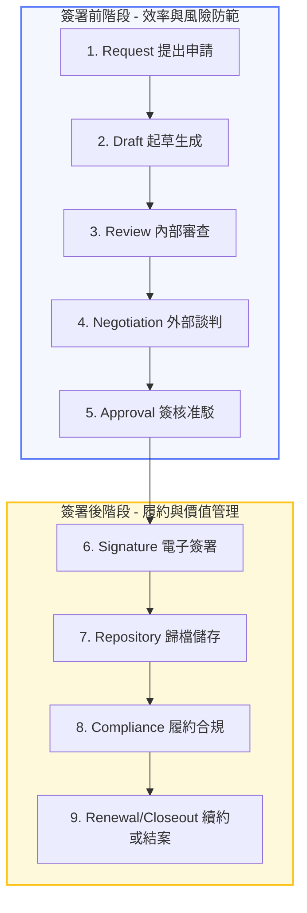
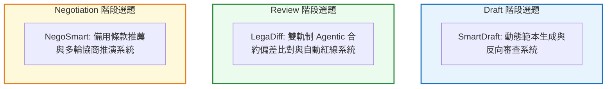

# CLM 合約生命週期管理：完整文獻與專案資料庫

本文件整合 CLM 框架定義、台灣在地文獻、國際量化數據、AI 技術解法、研究缺口分析與選題提案，供競賽簡報、專案設計與文獻引用使用。

---

## 🗺️ 一、 標準 CLM 框架與九大階段

合約生命週期管理（CLM）是指組織對於合約從需求提出、草擬、談判，到執行、歸檔及最後續約或結案的全生命週期數位化與系統化管理。其核心目標在於降低合約合規與商業風險、加速簽約週期（Cycle Time），並防範營收流失。

標準 CLM 框架包含以下九個核心階段，分為 **簽署前 (Pre-signature)** 與 **簽署後 (Post-signature)** 兩大範疇：



### 各階段說明

| 階段 | 主要角色 | 說明 |
| :--- | :--- | :--- |
| 1. Request | 業務、採購 | 提出合約需求，判斷適用範本 |
| 2. Draft | 法務 | 從範本庫生成第一版草稿 |
| 3. Review | 法務、資安、財務 | 審核條款、標記風險、紅線修改 |
| 4. Negotiation | 法務、業務、採購 | 與對方交換版本、談判爭議條款 |
| 5. Approval | 管理階層、法務 | 多層簽核確認最終版本 |
| 6. Signature | 雙方 | 電子簽署具法律效力版本 |
| 7. Repository | IT、法務 | 結構化歸檔、元數據索引 |
| 8. Compliance | 法務、業務 | 履約監控、里程碑提醒 |
| 9. Renewal | 採購、法務 | 到期前續約談判或結案 |

> **本專案聚焦範圍**：`Review` ➔ `Negotiation`（簽署前耗時最長、痛點最深的兩個階段）

---

## 🇹🇼 二、 台灣在地文獻與背景證據

### 1. 台灣痛點現況

| 角色 | 典型痛點 |
| :--- | :--- |
| 業務、採購 | 不知道用哪個範本、需求輸入不完整 |
| 法務（Draft） | 重複從頭改 Word、無條款庫、缺乏一致性 |
| 法務（Review） | 多版本併存，難抓真正變更內容 |
| 法務（Negotiation） | 來回修訂、備選條款不足、缺乏快速決策依據 |
| 管理階層 | 難確認簽署版是否等於核准版 |

### 2. 學術論文

| 論文 | 主要貢獻 | 來源 |
| :--- | :--- | :--- |
| 「法律科技對台灣律師及企業法務的影響及因應—從大語言模型談起」 | 探討 LLM 與台灣法律專業的制度限制、採用心理與組織轉型挑戰 | [airitilibrary](https://www.airitilibrary.com/Article/Detail/U0001-1020260102021003) |
| 「基於知識圖譜及自然語言之自動偵測違規契約」 | 以台灣契約文本為對象，結合 NLP 與 ChatGPT 進行違規偵測 | [airitilibrary](https://www.airitilibrary.com/Article/Detail/U0002-2702202414431500) |
| 「合約管理功能對委外績效影響之研究」 | 合約管理健全度與委外績效顯著正相關 | [airitilibrary](https://www.airitilibrary.com/Article/Detail/P20230131001-N202303220011-00004) |
| 「知識服務型組織的合約訴訟管理流程分析」 | 台灣企業法務中心個案，補足流程視角的在地證據 | [ndltd.ncl.edu](https://ndltd.ncl.edu.tw/handle/15533811699114704616) |

### 3. 法人研究

* **工研院《企業合約文本 AI 智慧處理技術》**：明確指出台灣法務人員面臨知識累積不足、合約審閱負擔重，並提出以 AI/NLP 協助條款辨識。[→ 來源](https://ictjournal.itri.org.tw/xmdoc/cont?xsmsid=0M236556839091904564&sid=0M262349103464370939)
* **工研院《企業合約智能解析與審閱應用》**：法人期刊正式來源，可作為台灣技術可行性背書。[→ 來源](https://ictjournal.itri.org.tw/xcdoc/cont?xsmsid=0M236556470056558161&sid=0O087365146515691444)

### 4. 產業報導與顧問調查

* **勤業眾信台灣**：台灣企業常見困境為合約數量暴增、缺乏管理系統、審閱吃緊。[→ 來源](https://www.deloitte.com/tw/tc/services/legal/case-studies/legal-technology-finance-management.html)
* **先行智庫**：五大痛點包括歸檔困難、簽核延誤、缺乏到期提醒、**版本控管缺失**、資料分散。[→ 來源](https://www.kscthinktank.com.tw/blog/企業數位化時代的挑戰：合約管理如何影響營運效/)
* **律果科技、Lawsnote、中華電信**：均將差異比對、風險提示列為主要功能，顯示痛點已被市場驗證。[→ 來源](https://ai-taiwan.com.tw/2025/vendor/66)

### 5. 台灣量化背景數據（間接引用）

* PwC Taiwan：企業數位工具採用率達 **85%**，但技術效益展現仍是弱點
* **63%** 台灣企業需依賴外部資源推動轉型；**45.5%** 中小企業主擔心投資無法達到預期效益
* 台灣律師事務所合約審閱收費約 **NT$8,000–12,000/件**，法律顧問約 **NT$3,000–8,000/小時**

---

## ⚠️ 三、 手動流程痛點與國際基準數據

### 1. 時間延誤與審查瓶頸

* **3.4 週的核准等待**：手動流程一份合約平均需 **3.4 週** 完成全部審批與簽約（*Agiled / DocuSign CLM Statistics*）
* **起草與審查佔比極高**：法務人員有 **40%–60% 的工作時間** 耗費在合約起草與審閱（*Thomson Reuters Legal Drafting Research*）
* **NDA 等標準合約拖延**：**56%** 法務團隊需耗費一週以上，其中三分之一達 15 天以上（*SpotDraft 2025, n=115*）
* **大量合約堆積**：**52%** 企業每年處理 101–1,000 份合約，每份耗費 **2–4 小時**；年審 500 份的典型團隊需花費 **188 個工作天**（*LegalOn 2025, n=286*）

### 2. 外部談判與協商落差

* **71%** 受訪者反映合約談判耗時過長；**40%** 法務主管承認風險管理是「緩慢且被動」的流程（*Infosys BPM / Gartner*）
* 協商週期差異：NDA 談判平均 **3 天**，MSA 平均 **25 天**（*Clause & Current Q4 2025*）
* 早期利害關係人參與可將週期縮短 **20%**，減少 **25%** 後期爭議（*WorldCC*）

### 3. 財務代價與營收流失

* 合約管理不善使企業平均流失 **9.2%** 年營收（*WorldCC / IACCM*）
* 審查延誤平均使新產品上市推遲 **6.5 天**，造成 **700 萬美元** 損失（*Gartner Research*）

---

## 🔬 四、 關鍵實驗研究與數據支撐

### 1. LawGeex vs 20 位執業律師（核心對照研究）✅

* **實驗設計**：AI 與 20 位執業律師同步盲測審閱相同 NDA
* **結果**：人工 **92 分鐘**；AI **26 秒**；AI 準確率 **94%** vs 律師平均 **85%**
* **來源**：[LawGeex NDA Study PDF](https://images.law.com/contrib/content/uploads/documents/397/5408/lawgeex.pdf)

### 2. 跨產業 5,000 份合約人機協作研究 ✅

* 審閱週期縮短 **62.8%**，錯誤偵測率提升 **67.3%**；製造業效益最顯著達 **73.8%**
* **來源**：[Annals of Applied Sciences](https://annalsofappliedsciences.com/index.php/aas/article/view/17)

### 3. LegalOn 2026 調查（n=452）✅

* **87%** 法務人員認為 AI 最適合用在 pre-signature 審查與 redlining
* 單份合約人工審閱平均 **3.1 小時**；**79%** 導入後工時顯著降低；**67%** 業務回應加快
* **來源**：[LegalOn 2026 Press Release](https://www.legalontech.com/press-releases/ai-adoption-in-contract-review-doubles-year-over-year)

### 4. 系統性文獻回顧

* AI 輔助審閱可降低分析時間最高達 **80%**；CLM 導入後合約週期縮短 **25–60%**
* **來源**：[AJIS Research](https://ajisresearch.com/index.php/ajis/article/download/27/26)

### 5. SAGE Journals 學術論文（AI in Negotiation）✅

* 作者：Tim Cummins & Keld Jensen，*Friend or foe? AI and negotiation*（2024）
* 結論：GenAI 可協助協商前條款分析與替代方案模擬，改善談判結果一致性
* **DOI**：[10.1177/20555636241256852](https://doi.org/10.1177/20555636241256852)

---

## 🤖 五、 AI 驅動 CLM 各階段技術解法

### 手動 vs. AI 流程時程對比

| 階段 | 手動平均耗時 | 主要瓶頸 | AI 自動化後 | 數據來源 |
| :--- | :--- | :--- | :--- | :--- |
| **Draft** | **3–5 天** | 範本管理混亂 | **11 分鐘**（AI 生成 + 律師複核） | [NexLaw 2024](https://www.nexlaw.ai/blog/contract-drafting-automation-with-ai-speed-vs-accuracy-explained-for-us-litigators/) |
| **Review** | **5–10 天**（NDA 人工 92 分鐘） | 法務 bottleneck、多輪 redline | AI 初審 **26 秒**；整體縮短 **80%** | [LawGeex Study](https://images.law.com/contrib/content/uploads/documents/397/5408/lawgeex.pdf) |
| **Approval** | **3–7 天** | 多層簽核等待 | — | [Agiled 2026](https://agiled.app/statistics/contract-management-statistics) |
| **Signature** | **1–5 天** | 手動列印掃描 | — | [Agiled 2026](https://agiled.app/statistics/contract-management-statistics) |
| **全程** | **3.4 週（約 19 天）** | 累積等待 | **3–5 天** | [SpotDraft 2025](https://www.businesswire.com/news/home/20250820510824/en/Legal-Teams-Could-Cut-Contract-Time-and-Improve-Efficiency-by-73-with-AI-But-Most-Stick-with-Manual-Processes) |

### Draft 階段 AI 技術解法

* **GenAI 首稿生成**：自業務需求自動產生草稿，支援多語言與產業特有條款（*Concord AI CLM, 2026*）
* **動態條款庫（Clause Advisor）**：依合約類型、地區、風險等級推薦條款（*elsAI CLM on Azure, 2026*）
* **RAG + LLM 歷史回溯**：結合企業歷史合約庫確保草稿符合過去談判立場（*Contrato360 2.0, arXiv:2412.17942*）
* **主動歧義偵測**：自動標記模糊條款並生成澄清問題（*arXiv:2403.08053*）

**效益數據**：起草時間 1.8 小時 → 11 分鐘；AI 一致性 96.4% vs 人工 88.1%（*NexLaw 2024*）

### Review 階段 AI 技術解法（四階段 Pipeline）

1. **Intake**：OCR + 分類模型，自動識別合約類型（NDA / SLA / 採購）
2. **Clause Extraction**：NLP 對應 CUAD 資料集 41 種條款類型（13,000+ 標注，*arXiv:2103.06268*）
3. **Deviation Analysis**：對照企業 Playbook，自動標記非標準條款與風險漏洞
4. **Auto Redline**：AI 依 Playbook 產生修訂建議，只將真正有爭議條款呈交人工（*DigitalApplied, 2026*）

**效益數據**：Redlining 準確率 96.46%（*JP Morgan，經 Dioptra 引用*）；Screens GenAI 97.6%（*Artificial Lawyer, 2024*）；審閱時間縮短 80%

### Negotiation 階段 AI 技術解法

* **Fallback Clause Library**：預核准備用條款資料庫，即時推薦妥協方案（*elsAI CLM Smart Negotiator*）
* **Agentic Negotiation**：LLM Agent 閱讀合約、建議替代條款、進行多輪結構化協商（*CallSphere AI, 2026*）
* **數據驅動決策**：分析歷史協商數據推薦成功率最高的策略（*AJMJ 2025*）
* **大規模實驗**：120,000 場 LLM 自動協商測試，頂尖 Agent 能採用「關係建立」「互惠妥協」等人類策略（*arXiv:2503.06416*）

**效益數據**：談判週期縮短 40–60%（*McKinsey，經 CallSphere 引用*）

---

## 🔍 六、 研究缺口與競賽定位

### 研究缺口三層架構

| 層次 | 現況 | 意涵 |
| :--- | :--- | :--- |
| **國際** | 大量量化研究確認 Draft / Review / Negotiation 是最耗時、最適合 AI 導入的階段 | 問題已被充分定義 |
| **台灣（質性）** | 工研院、勤業眾信、先行智庫確認台灣同樣面臨版本控管困難、法務 bottleneck | 痛點在台灣確實存在 |
| **台灣（量化）** | ❌ 目前缺乏針對台灣企業 CLM 工時結構、審查延遲、協商週期的系統性量化研究 | **本專案的研究貢獻空間** |

### 可直接引用的摘要段落（競賽 / 簡報用）

> 合約生命週期管理（CLM）中的草擬、審查與協商階段，是企業法務與商務流程中最耗時且最容易產生版本錯誤的環節。國際研究指出，法律專業人員約有 40%–60% 的工時花費於合約起草與審閱，而手動合約流程平均週期約為 3.4 週。在審查階段，法務人員平均需花費 3.1 小時審閱一份合約，且多數團隊仍以 email、Word 與共用資料夾處理版本往返，造成差異追蹤困難與風險條款遺漏。雖然台灣目前缺乏對 CLM 工時結構與審閱週期的系統性量化研究，但本地產業報導與法人技術研究已證實台灣企業同樣面臨版本控管困難、合約散落、法務審查瓶頸與修訂透明度不足等問題。因此，針對台灣企業常見的 SLA、NDA 與採購合約，在 Draft / Review / Negotiation 階段導入 AI 驅動的版本差異比對、風險條款標示與協商建議生成機制，具有明確的研究價值與實務應用潛力。

---

## 🎯 七、 本專案「合約智能比對助理」核心定位

### 定位環節：`Review` ➔ `Negotiation`

```text
[合約起草] ➔ 【 智能比對與初審 】 ➔ 【 風險標記 & 協商對策 】 ➔ [內部核准] ➔ [正式簽署]
               └─ 本專案核心價值 ─┘     └─ 本專案核心價值 ─┘
```

### 三層核心價值

1. **比對加速（Review）**：LCS + Needleman-Wunsch 演算法，將多版本合約比對縮短至秒級，自動過濾行政性小修改
2. **風險判讀（Review）**：Risk Rule Engine 硬性偵測高風險條款異動，確保 **100% 召回率**，不依賴 LLM 判斷避免幻覺漏判
3. **對策建議（Negotiation）**：LLM 生成白話摘要，並針對高風險條款提供 2-3 個可直接用於協商的妥協方案

### 競品差異

| 功能 | 本系統 | Lumine AI |
| :--- | :--- | :--- |
| 差異比對 | ✅ | ✅ |
| 重點摘要（3-5 點） | ✅ | ❌ |
| 風險等級標示 | ✅ | 部分 |
| **協商對策建議** | ✅ | ❌ |
| **可量化驗證（gold set）** | ✅ 100% recall | ❌ |
| 繁體中文 SLA 優化 | ✅ | ❌ |

### 填補研究缺口的方式

以台灣企業常見的 SLA / NDA / 採購合約為對象，建立 38 筆人工標註 gold set，高風險召回率達 100%，為台灣合約 AI 審查場景提供本地化實證基礎。

---

## 💡 八、 三階段選題提案與系統設計建議



### 提案一：Draft — `SmartDraft` 動態範本生成與反向偏差起草系統

* **核心定位**：解決業務 / 採購起草合約時，手動套用舊範本容易殘留髒資料，或直接被對方合約牽著走的問題
* **主要功能**：動態範本拼裝 / 反向偏差標記（Reverse-Redlining）/ 黃金範本歸納
* **技術架構**：RAG + 條款範本資料庫（pgvector）+ LLM 條件化合成引擎

### 提案二：Review — `LegaDiff` 雙軌制 Agentic 合約偏差比對與自動紅線系統（**推薦 / 現有方向**）

* **核心定位**：解決合約多輪修改來回傳遞時，Word Compare 無法分析修改背後商業風險與給出協商對策的痛點
* **主要功能**：條款級語意比對 / Playbook 偏差分析 / 自動紅線與協商對策
* **技術架構**：diff-match-patch + Risk Rule Engine + LLM 協商建議生成
* **專案亮點**：雙軌架構（規則引擎保證不漏判 + LLM 白話解釋），最符合台灣企業法務安全需求

### 提案三：Negotiation — `NegoSmart` 備用條款推薦與協商沙盤推演系統

* **核心定位**：雙方針對高風險條款僵持時，AI 主動提供預審備用條款避免合約延誤數週
* **主要功能**：Fallback Clause（Tier-1/2/3 三層）/ 歷史讓步軌跡分析 / 雙 Agent 談判推演
* **技術架構**：知識圖譜 + Fallback 資料庫 + LLM Multi-Agent 推演環境

### 三提案綜合比較

| 評估維度 | SmartDraft（Draft） | **LegaDiff（Review）** | NegoSmart（Negotiation） |
| :--- | :--- | :--- | :--- |
| 技術難易度 | ⭐⭐⭐ 中等 | ⭐⭐⭐⭐ 中高 | ⭐⭐⭐⭐⭐ 高 |
| 商業價值 / ROI | ⭐⭐⭐⭐ | ⭐⭐⭐⭐⭐ | ⭐⭐⭐⭐ |
| 與競賽主題契合度 | 偏向產出合約範本 | **自動比對差異 + 標示異動** | 妥協方案推薦 |
| 現有基礎 | 需從頭建 | ✅ 已完成核心雛形 | 需從頭建 |

**建議選擇 LegaDiff（提案二）**：業務最痛苦的不是沒有範本，而是「對方改了範本，看不出改了哪裡、有什麼風險」。現有專案已完成 LCS 對齊、Risk Rule Engine、FastAPI，繼續深化（DOCX 支援、台灣法條 MCP 整合）即可在最短時間產出完整成果。
